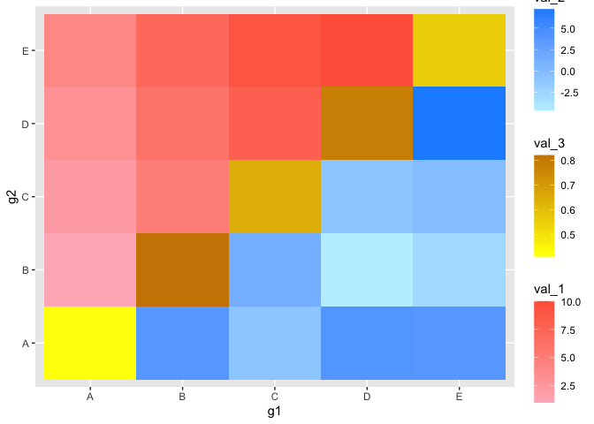
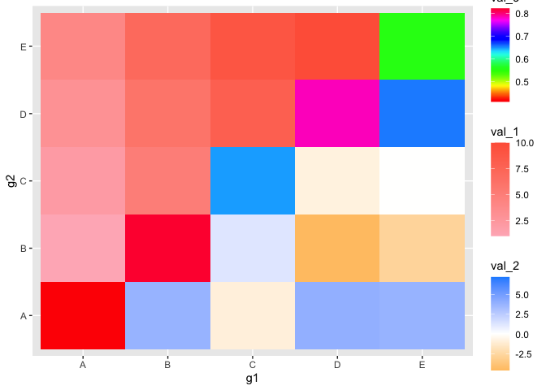
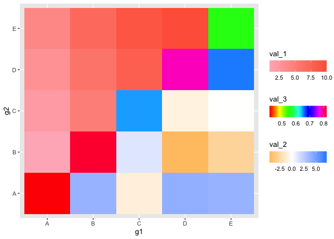
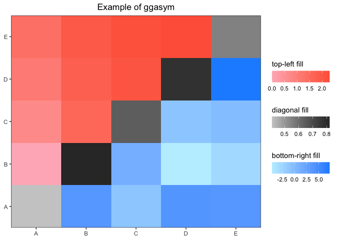
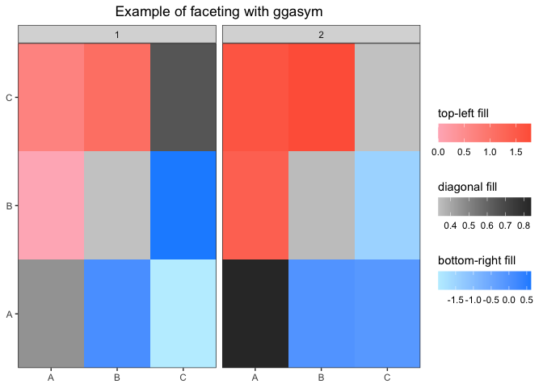
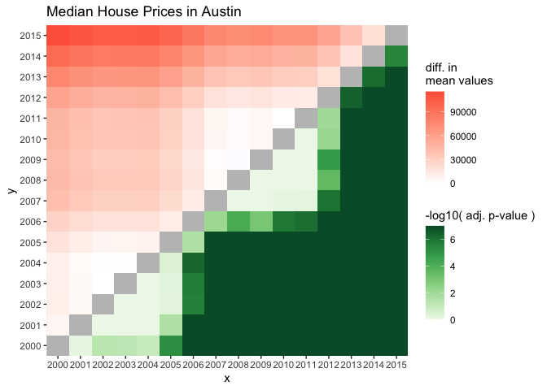

<!-- README.md is generated from README.Rmd. Please edit that file -->

# ggasym <a href="https://jhrcook.github.io/ggasym/index.html">  </a>

[](https://www.gnu.org/licenses/gpl-3.0)
[](https://cran.r-project.org/package=ggasym)
[](https://cran.r-project.org/package=ggasym)
[](https://github.com/jhrcook/ggasym/actions)
[](https://travis-ci.org/jhrcook/ggasym)
[](https://ci.appveyor.com/project/jhrcook/ggasym)
[](https://codecov.io/github/jhrcook/ggasym?branch=master)

## Asymmetric Matrix Plotting in ‘ggplot’

‘ggasym’ (pronounced “gg-awesome”) plots a symmetric matrix with three
different fill aesthetics for the top-left and bottom-right triangles
and along the diagonal. It operates within the Grammar of Graphics
paradigm implemented in [‘ggplot2’](https://ggplot2.tidyverse.org).

Checkout the documentation and vignettes at the pkgdown website
[https://jhrcook.github.io/ggasym/](https://jhrcook.github.io/ggasym/index.html)

For information on using ‘ggplot2’, start
[here](https://ggplot2.tidyverse.org/index.html).

## Download and Installation

‘ggasym’ is available on CRAN. Use the following command to install.

``` r
install.packages("ggasym")
```

You can download and install the latest development version from the
GitHub repo.

``` r
devtools::install_github("jhrcook/ggasym")
```

And load the package with the standard `library` function.

``` r
library(ggasym)
```

## Basic Usage

Here is a basic example. `tib` is a “tibble” (i.e.. fancy “data.frame”)
of comparisons between groups “A” through “E”. There are two values to
be plotted, `val_1` and `val_2`, that hold data on the comparison
between `g1` and `g2`. `tib` is first passed to `asymmetrise()` to fill
in all the missing combinations between `g1` and `g2` such that the
symmetric matrix can be built. All added values take the value `NA`. The
modified data table is finally passed to `ggplot()` and `geom_asymmat()`
is added on. Here, `asymmetrise()` added the rows where `g1` and `g2`
are equal, thus will fill the diagonal. I set these values to `val_3`.

``` r
tib <- tibble(g1 = c("A", "A", "A", "A", "B", "B", "B", "C", "C", "D"),
              g2 = c("B", "C", "D", "E", "C", "D", "E", "D", "E", "E"),
              val_1 = seq(1, 10, 1),
              val_2 = rnorm(10, mean = 0, sd = 3))
tib <- asymmetrise(tib, g1, g2)
tib$val_3 <- runif(nrow(tib))
ggplot(tib, aes(x = g1, y = g2)) +
    geom_asymmat(aes(fill_tl = val_1, fill_br = val_2, fill_diag = val_3)) +
    scale_fill_tl_gradient(low = "lightpink", high = "tomato") +
    scale_fill_br_gradient(low = "lightblue1", high = "dodgerblue") +
    scale_fill_diag_gradient(low = "yellow", high = "orange3")
```

<!-- -->

## New Aesthetics

The new aesthetics `fill_tl`, `fill_br`, and `fill_diag` behave just
like the normal `fill`, except that they correspond to the top-left
(“tl”) and bottom-right (“br”) triangles of the matrix,
respectively. This package also includes analogous functions for scaling
the fill colors such as `scale_fill_tl_gradient2()` and
`scale_fill_br_gradientn()` that operate just as expected when using
‘ggplot2’.

``` r
ggplot(tib, aes(x = g1, y = g2)) +
    geom_asymmat(aes(fill_tl = val_1, fill_br = val_2, fill_diag = val_3)) +
    scale_fill_tl_gradient(low = "lightpink", high = "tomato") +
    scale_fill_br_gradient2(low = "orange", mid = "white", high = "dodgerblue") +
    scale_fill_diag_gradientn(colors = rainbow(25))
```

<!-- -->

### Adjusting Colorbars

Of note, with three colorbars, it may be useful to control their
position and other properties. This can be done just like normal in
‘ggplot2’ by passing the correct values to the `guide` parameter in
`scale_fill_*_gradient()` ([original
documentation](https://ggplot2.tidyverse.org/reference/guide_colourbar.html)).
Below are a few of the options where I put the bars horizontal, adjust
the ordering, and put the title above each.

``` r
ggplot(tib, aes(x = g1, y = g2)) +
    geom_asymmat(aes(fill_tl = val_1, fill_br = val_2, fill_diag = val_3)) +
    scale_fill_tl_gradient(low = "lightpink", high = "tomato",
                           guide = guide_colourbar(direction = "horizontal",
                                                   order = 1,
                                                   title.position = "top")) +
    scale_fill_br_gradient2(low = "orange", mid = "white", high = "dodgerblue",
                           guide = guide_colourbar(direction = "horizontal",
                                                   order = 3,
                                                   title.position = "top")) +
    scale_fill_diag_gradientn(colors = rainbow(25),
                           guide = guide_colourbar(direction = "horizontal",
                                                   order = 2,
                                                   title.position = "top"))
```

<!-- -->

## Full ggplot2 integration

Since the new geom is a normal ‘ggplot2’ object, it can be introduced
into a standard ‘ggplot2’ workflow. Note that the labels can be adjusted
like normal using the `labs` function and using the `fill_tl`,
`fill_br`, and `fill_diag` arguments.

``` r
ggplot(tib, aes(x = g1, y = g2)) +
    geom_asymmat(aes(fill_tl = log(val_1),
                     fill_br = val_2,
                     fill_diag = val_3)) +
    scale_fill_tl_gradient(low = "lightpink", high = "tomato",
                           guide = guide_colourbar(direction = "horizontal",
                                                   order = 1,
                                                   title.position = "top")) +
    scale_fill_br_gradient(low = "lightblue1", high = "dodgerblue",
                           guide = guide_colourbar(direction = "horizontal",
                                                   order = 3,
                                                   title.position = "top")) +
    scale_fill_diag_gradient(low = "grey80", high = "grey20",
                           guide = guide_colourbar(direction = "horizontal",
                                                   order = 2,
                                                   title.position = "top")) +
    labs(fill_tl = "top-left fill",
         fill_br = "bottom-right fill",
         fill_diag = "diagonal fill",
         title = "Example of ggasym") +
    theme_bw() +
    theme(axis.title = element_blank(),
          plot.title = element_text(hjust = 0.5),
          panel.background = element_rect(fill = "grey70"),
          panel.grid = element_blank()) +
    scale_x_discrete(expand = c(0, 0)) +
    scale_y_discrete(expand = c(0, 0))
```

<!-- -->

## Faceting

If you have multiple categories, faceting works as expected. The only
difference is in the preparation of the data table: you must
`group_by()` the value(s) you will facet by before passing to
`asymmetrise()`. This is shown below.

``` r
tib <- tibble(g1 = rep(c("A", "A", "B"), 2),
              g2 = rep(c("B", "C", "C"), 2),
              val_1 = seq(1, 6),
              val_2 = rnorm(6),
              grps = c(1, 1, 1, 2, 2, 2))
tib
#> # A tibble: 6 x 5
#>   g1    g2    val_1   val_2  grps
#>   <chr> <chr> <int>   <dbl> <dbl>
#> 1 A     B         1  0.0746     1
#> 2 A     C         2 -1.99       1
#> 3 B     C         3  0.620      1
#> 4 A     B         4 -0.0561     2
#> 5 A     C         5 -0.156      2
#> 6 B     C         6 -1.47       2
```

Grouping first by `grps`, the tibble is asymmetrized while retaining the
`grps` assignments. I then added values to the diagonal.

``` r
tib <- tib %>% group_by(grps) %>% asymmetrise(g1, g2) %>% ungroup()
tib <- tib %>% mutate(val_3 = ifelse(g1 == g2, runif(nrow(tib)), NA))
tib
#> # A tibble: 18 x 6
#>     grps g1    g2    val_1   val_2  val_3
#>    <dbl> <chr> <chr> <int>   <dbl>  <dbl>
#>  1     1 A     B         1  0.0746 NA
#>  2     1 A     C         2 -1.99   NA
#>  3     1 B     C         3  0.620  NA
#>  4     1 B     A         1  0.0746 NA
#>  5     1 C     A         2 -1.99   NA
#>  6     1 C     B         3  0.620  NA
#>  7     1 A     A        NA NA       0.459
#>  8     1 B     B        NA NA       0.332
#>  9     1 C     C        NA NA       0.651
#> 10     2 A     B         4 -0.0561 NA
#> 11     2 A     C         5 -0.156  NA
#> 12     2 B     C         6 -1.47   NA
#> 13     2 B     A         4 -0.0561 NA
#> 14     2 C     A         5 -0.156  NA
#> 15     2 C     B         6 -1.47   NA
#> 16     2 A     A        NA NA       0.839
#> 17     2 B     B        NA NA       0.347
#> 18     2 C     C        NA NA       0.334
```

``` r
ggplot(tib, aes(x = g1, y = g2)) +
    geom_asymmat(aes(fill_tl = log(val_1),
                     fill_br = val_2,
                     fill_diag = val_3)) +
    scale_fill_tl_gradient(low = "lightpink", high = "tomato",
                           guide = guide_colourbar(direction = "horizontal",
                                                   order = 1,
                                                   title.position = "top")) +
    scale_fill_br_gradient(low = "lightblue1", high = "dodgerblue",
                           guide = guide_colourbar(direction = "horizontal",
                                                   order = 3,
                                                   title.position = "top")) +
    scale_fill_diag_gradient(low = "grey80", high = "grey20",
                           guide = guide_colourbar(direction = "horizontal",
                                                   order = 2,
                                                   title.position = "top")) +
    labs(fill_tl = "top-left fill",
         fill_br = "bottom-right fill",
         fill_diag = "diagonal fill",
         title = "Example of faceting with ggasym") +
    theme_bw() +
    theme(axis.title = element_blank(),
          plot.title = element_text(hjust = 0.5),
          panel.background = element_rect(fill = "grey70"),
          panel.grid = element_blank()) +
    scale_x_discrete(expand = c(0, 0)) +
    scale_y_discrete(expand = c(0, 0)) +
    facet_grid(. ~ grps)
```

<!-- -->

-----

## Statistical Test Wrapper

I created a wrapper for handling the results of a statistical test to
produce a tibble ready to be plotted with ggasym. Here is a brief
example - a more detailed example is shown in the vignette [“Statistical
Test
Plotting”](https://jhrcook.github.io/ggasym/articles/ggasym-stats.html).
Here I test if the median sale price of houses in Austin, Texas is
different between any of the years (for more information on the data
source: `?ggplot2::txhousing`).

``` r
tib <- ggplot2::txhousing %>%
    filter(city == "Austin") %>%
    mutate(year = as.character(year))
aov_res <- aov(median ~ year, data = tib)
broom::tidy(aov_res)
#> # A tibble: 2 x 6
#>   term         df         sumsq       meansq statistic    p.value
#>   <chr>     <dbl>         <dbl>        <dbl>     <dbl>      <dbl>
#> 1 year         15 169514394144. 11300959610.      213.  4.29e-102
#> 2 Residuals   171   9077385000.    53084123.       NA  NA
```

Before plotting, the results of the Tukey post-hoc test are passed to
`asymmetrise_stats()` that prepares the data for `geom_asymmat()`. The
resulting tibble is then plotted and styled in ‘ggplot2’.

``` r
asymmat_tib <- asymmetrise_stats(TukeyHSD(aov_res))
ggplot(asymmat_tib, aes(x = x, y = y)) +
    geom_asymmat(aes(fill_tl = estimate,
                     fill_br = -log10(adj.p.value + 0.0000001))) +
    scale_fill_tl_gradient2(low = "dodgerblue", high = "tomato") +
    scale_fill_br_distiller(type = "seq", palette = "Greens", direction = 1) +
    labs(title = "Median House Prices in Austin",
         fill_tl = "diff. in\nmean values",
         fill_br = "-log10( adj. p-value )") +
    theme(panel.background = element_rect(fill = "grey75"),
          panel.grid = element_blank()) +
    scale_x_discrete(expand = c(0, 0)) +
    scale_y_discrete(expand = c(0, 0))
```

<!-- -->

-----

### Thank yous

I would like to thank the team behind
[‘ggplot2’](https://ggplot2.tidyverse.org) for creating a flexible
and powerful package for the R community.

If you see any mistakes (including small typos) *please* open an
[issue](https://github.com/jhrcook/ggasym/issues) and leave a quick
statement. Do not worry about appearing annoying.
